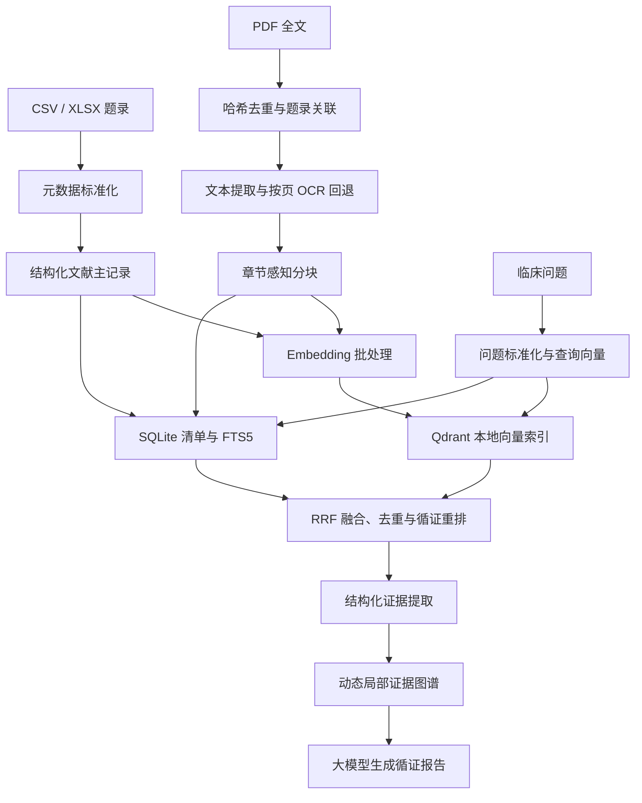

# MPP 混合检索 Graph RAG 知识库设计规格

日期：2026-08-02
状态：设计讨论已确认，等待书面规格审阅

## 1. 背景

现有 MPP_Project 是一个可运行的循证 Graph RAG 演示系统。当前网页基于 `evidence_nodes.json` 和 `evidence_edges.json` 中预先整理的少量证据进行检索和回答，可以展示证据金字塔、证据关系和两部分循证输出，但尚未接入用户的真实文献库。

本次功能将本地目录 `C:\Users\LTC\Desktop\MPP` 接入系统。经核对，该目录包含：

- 35,408 条题录元数据，字段包括标题、作者、年份、期刊、DOI、URL和摘要等；
- 909 个 PDF 文件；
- 2 个 XLSX 文件、1 个 CSV 文件和1个 ZIP文件；
- PDF 中可能存在内容重复、扫描页、损坏文件和无法与题录自动匹配的文件。

因此，本项目的准确数据口径是“约3.5万条文献题录，其中约900篇具有本地PDF全文”，不是3.5万篇本地全文。

## 2. 目标

MVP 必须实现以下能力：

1. 导入全部题录，并解析、去重、关联本地 PDF；
2. 同时对题录标题/摘要和 PDF 正文建立向量索引；
3. 使用 Qdrant 本地模式完成语义检索，使用 SQLite FTS5 完成关键词检索；
4. 融合两路结果，并按照证据类型、研究质量、发表时间和来源完整度进行循证重排；
5. 围绕当前问题动态构建局部证据图谱，不为全部题录建立全量两两关系；
6. 在网页中输出可折叠的循证分析记录和综合回答；
7. 所有关键数字和判断可以追溯到文献、正文片段和页码；
8. 支持增量构建、断点恢复、失败重试和无向量接口时的关键词降级；
9. 原始文献、API Key、数据库和向量索引只保存在本地，不进入 Git 仓库。

## 3. 非目标

本轮不实现以下功能：

- 医学影像分析或多模态模型训练；
- 对35,408条记录逐条调用大模型进行精细证据评价；
- 建立覆盖全部文献的永久全局关系图；
- 自动作出临床诊断、开具处方或替代医生决策；
- 从互联网自动下载缺失全文；
- 将用户的原始 PDF 或本地索引随代码上传到 GitHub；
- 在第一版中覆盖 MPP 以外的通用医学知识库管理需求。

## 4. 总体架构

系统采用“离线知识库构建 + 在线混合检索与生成”架构。



新增代码集中在独立的 `knowledge_base/` 包中。现有网页和 Graph RAG 演示逻辑通过明确接口调用该包，避免把文献解析、存储和循证生成继续堆叠到 `web_api.py` 中。

## 5. 模块边界

`knowledge_base/` 包包含以下职责单一的模块：

| 模块 | 职责 |
|---|---|
| `config.py` | 读取环境变量、路径和可调参数，验证配置 |
| `models.py` | 定义文献、文件、文本块、检索结果和证据声明的数据结构 |
| `metadata_loader.py` | 导入 CSV/XLSX，清洗字段并生成文献主记录 |
| `deduplicator.py` | 文件哈希、DOI和标准化标题去重，维护别名关系 |
| `pdf_parser.py` | PDF逐页解析、质量检测、OCR回退和错误记录 |
| `chunker.py` | 按章节和页码生成可追溯文本块 |
| `embedding_client.py` | OpenAI兼容 Embedding 请求、批处理、重试和缓存 |
| `vector_store.py` | Qdrant集合管理、写入、查询和维度校验 |
| `lexical_store.py` | SQLite清单、任务状态及FTS5关键词索引 |
| `indexer.py` | 编排增量导入、解析、分块和向量化流程 |
| `retriever.py` | 语义/关键词检索、RRF融合、过滤和去重 |
| `evidence_classifier.py` | 证据类型、质量信号和时间关系识别 |
| `graph_builder.py` | 为当前问题建立局部证据图谱 |
| `reporter.py` | 组织可核验分析记录并调用大模型生成回答 |
| `cli.py` | 提供 inspect、build、status、retry 和 query 命令 |

模块通过数据对象而不是隐式全局变量通信。Qdrant和SQLite由存储适配层封装，网页层不直接读写底层数据库。

## 6. 本地目录与配置

默认配置如下，所有值均可通过环境变量覆盖：

```text
MPP_KB_SOURCE=C:\Users\LTC\Desktop\MPP
MPP_KB_DATA=.local\knowledge_base
MPP_EMBEDDING_MODEL=text-embedding-3-large
```

`MPP_API_BASE`、`MPP_API_KEY` 和 `MPP_CHAT_MODEL` 是无默认值的必填环境变量；缺少任一项时，模型连接检查应指出具体缺失项，不能使用代码中的隐式密钥或模型名。

`.local/`、`.env`、SQLite文件、Qdrant目录、OCR临时文件和日志中的敏感字段必须加入 `.gitignore`。仓库可提供不含密钥的 `.env.example`。

Embedding 时会将文本块发送给外部兼容接口；生成答案时会将问题和最终选中的证据片段发送给聊天接口。系统不上传原始PDF文件，但部署说明必须明确上述文本传输边界。

## 7. 题录导入与文献主记录

CSV是默认的题录事实来源。XLSX中的下载标记可作为辅助字段导入，但不能用标记数量替代实际PDF文件数量。

每条题录生成稳定的 `document_id`。优先使用标准化 DOI 的哈希；没有 DOI 时使用标准化标题、第一作者和年份生成稳定哈希。主记录至少保存：

- 原始ID及来源行号；
- 标题、作者、年份、期刊、摘要、DOI、URL和语言；
- 标准化标题和标准化DOI；
- 证据类型、分类置信度和分类依据；
- 是否有全文、关联文件ID和全文解析状态；
- 创建时间、更新时间和内容哈希。

缺失字段不导致记录丢弃。无标题且无摘要的记录进入低信息清单，不参与默认向量化，但仍保留审计状态。

## 8. PDF关联与去重

PDF与题录按照以下优先级关联：

1. DOI完全一致；
2. 文件名中的数据集ID或数字前缀与题录ID一致；
3. 标准化标题完全一致；
4. 标题高相似度，并同时满足作者或年份一致；
5. 无法可靠匹配时标记为 `unmatched`，保留文件但不做错误自动合并。

去重分为三层：

- 文件级：SHA256相同的PDF只解析和向量化一次；
- 文献级：标准化DOI相同的题录合并到同一主记录；
- 疑似重复：标题高度相似但DOI不足以确认时，只标记关系，不自动删除。

所有原始来源作为别名记录保留。最终检索按 `document_id` 去重，防止一项研究因多个文件或多条题录被重复计算为多项证据。

## 9. PDF解析、OCR与分块

解析器使用 PyMuPDF 逐页提取文字并记录页码。页面出现以下情况时进入OCR队列：

- 提取文本低于质量阈值；
- 字符乱码比例过高；
- 页面只有扫描图像而没有有效文本层。

OCR使用 RapidOCR的本地ONNX运行时，仅处理失败页面，不重新OCR整篇正常PDF，也不调用外部视觉模型。加密、截断或无法打开的PDF记录明确错误码，单篇失败不终止整个构建任务。

分块优先识别摘要、方法、结果、讨论和结论等章节边界。默认块大小为600至900 tokens，重叠约100 tokens；超长表格或连续结果段可以单独成块。每个块必须保存：

- `chunk_id`、`document_id`和内容哈希；
- 正文文本、章节标题和块类型；
- 起止页码及原始PDF路径；
- 是否来自OCR、解析质量和语言；
- 标题、年份、DOI和证据类型等检索载荷。

分块算法版本写入清单。算法变更时只重建受影响的块和向量。

## 10. 向量化和本地存储

系统使用 OpenAI兼容的 `/embeddings` 接口和 `text-embedding-3-large` 模型。启动或构建前必须执行探测请求，确认鉴权、模型可用性、响应格式和实际向量维度。向量维度从首次成功响应读取，不能硬编码。

默认每批发送32个文本块，可通过配置降低。客户端必须支持：

- 超时、指数退避和带抖动重试；
- 401/403鉴权错误立即停止并给出明确提示；
- 429和临时5xx错误按上限重试；
- 按内容哈希缓存结果，避免重复调用和重复计费；
- 逐批提交任务状态，程序中断后从未完成批次继续；
- 日志中不打印Authorization头或API Key。

Qdrant使用本地模式，不要求Docker。建立两个逻辑集合：

- `mpp_metadata`：题录标题、摘要和关键词向量；
- `mpp_fulltext`：PDF正文块向量。

SQLite保存文献主记录、文件清单、别名、文本块、构建任务、错误信息和Embedding缓存索引。FTS5分别索引题录与正文；中文使用 jieba 搜索模式分词后写入以空格分隔的词项，英文使用小写规范化词项。PyMuPDF、RapidOCR或jieba等必需依赖缺失时，`inspect`命令必须报告安装问题，不能静默建立不完整索引。

## 11. 在线混合检索

用户问题首先进行轻量标准化，并尽可能提取人群、干预、对照和结局（PICO）。系统并行执行：

- Qdrant语义检索：题录集合默认取前40条，全文集合默认取前80个文本块；
- SQLite FTS5关键词检索：题录索引默认取前40条，全文索引默认取前80个文本块。

四个有序结果列表使用 Reciprocal Rank Fusion（RRF）融合，默认常数为60。之后按以下顺序处理：

1. 按文献主记录去重，同时保留同一文献中最相关的少量片段；
2. 过滤与问题人群或干预明显不符的结果；
3. 将约40个融合候选送入循证重排；
4. 保留20至30个候选用于证据盘点；
5. 选择8至15篇具有代表性的文献进入最终上下文。

循证等级是有界排序信号，不能让主题无关的指南压过高度相关的RCT。时间也是有界信号，新发表的病例报告不能仅凭年份覆盖高质量指南或RCT。结果集还要执行来源多样化，避免最终证据全部来自同一文献或同一证据类型。

如果Embedding接口不可用但本地FTS5已建立，查询自动进入关键词模式，并在响应和网页中明确标注降级状态。

## 12. 证据分类、质量与时间关系

第一阶段使用确定性规则从题录和正文识别以下类型：

1. 临床指南和专家共识；
2. 系统综述和Meta分析；
3. 随机对照试验；
4. 队列研究和病例对照研究；
5. 病例系列和病例报告；
6. 叙述性综述及其他研究。

规则保存命中依据和置信度。仅当进入当前问题的高相关候选仍无法分类时，才调用大模型辅助分类，避免为全部3.5万条记录产生不必要成本。

同一类型内部提取可核验质量信号，例如指南证据截止时间、系统综述纳入研究类型、RCT是否多中心及样本量、观察性研究是否控制混杂，以及文献是否有可核查全文。质量信号缺失时标记未知，不由模型猜测。

时间比较同时考虑发表时间、指南发布时间和可获得的证据检索截止时间。晚于指南截止时间的高质量RCT可以被标记为 `updates` 或 `supplements`，但不会自动宣称“推翻指南”。新病例报告只能提供特殊情形或安全性提示。

## 13. 结构化证据与局部图谱

进入最终候选的文献需要提取结构化声明：

- 研究人群、干预、对照和结局；
- 研究设计、样本量和随访时间；
- 剂量、效应值、置信区间和不良事件；
- 主要结论、局限性及其来源片段。

局部图谱包含问题、文献、证据声明和结局节点。关系限定为：

- `supports`：支持已有结论；
- `updates`：提供时间上更新且质量足够的证据；
- `supplements`：补充剂量、人群、结局或安全性信息；
- `conflicts`：可比条件下结论不一致；
- `cautions`：提供风险或特殊病例提示。

每条边必须携带来源片段ID和生成依据。无法可靠判断关系时不创建强关系边。图谱仅针对本次问题生成并可缓存，不执行全库两两比较。

## 14. 大模型生成约束

生成器使用最终证据包，而不是直接读取全部检索结果。提示词要求模型生成两个部分：

1. 可折叠的“循证分析过程”，展示证据库存、证据层级、时间关系、一致性和局限性；
2. “综合循证回答”，包含推荐、适用范围、关键依据、风险、不确定性和不适用范围。

这里展示的是可核验的循证处理记录，不暴露或伪造模型不可验证的内部思维链。所有样本量、剂量、效应值和置信区间必须来自证据包中的明确片段。没有依据时输出“当前证据不足”，不得补全数字。

引用采用稳定编号并关联 `document_id` 和 `chunk_id`。只有摘要的来源必须标注“摘要级证据”；有全文时显示章节和页码。

## 15. 网页与API

主页面直接提供临床问题工作台。高级筛选支持人群、年份、证据类型和“仅全文”。查询过程显示以下可理解阶段：

```text
问题结构化 -> 混合检索 -> 证据分层 -> 时间与一致性分析 -> 局部图谱 -> 生成报告
```

结果页面包含：

- 可折叠循证分析步骤；
- 综合回答；
- 可点击引用和命中原文；
- 证据关系图谱；
- 摘要级/全文级来源标识；
- 当前是否处于关键词降级模式。

知识库管理页面显示题录、PDF、匹配、重复、解析、OCR、分块、向量化及失败数量，并提供构建、暂停、继续和重试失败项操作。暂停在当前文件或Embedding批次完成后生效，不强行终止正在写入的事务。长时间构建作为后台任务运行，不阻塞Web服务；进程锁保证同一知识库目录同时只有一个写入任务。

建议API边界：

- `GET /api/health`：Web、SQLite、Qdrant和模型服务状态；
- `GET /api/kb/status`：知识库统计和构建进度；
- `POST /api/kb/build`：启动或继续构建，首次批量Embedding必须携带明确确认参数；
- `POST /api/kb/pause`：在当前安全批次结束后暂停构建；
- `POST /api/kb/retry`：重试指定失败类型；
- `POST /api/query`：执行混合检索与循证回答；
- `GET /api/documents/{document_id}`：返回题录、片段和本地全文状态；
- `GET /api/jobs/{job_id}`：轮询后台任务状态。

API Key只从后端环境变量读取。网页不提供Key输入框，也不把Key写入响应、日志、前端存储或配置文件。

## 16. 状态、错误与可恢复性

文献构建状态至少包括：

```text
pending -> parsed -> chunked -> embedded -> indexed -> completed
```

失败状态保存阶段、错误码、简短信息、重试次数和最后更新时间。以下情况必须给出用户可理解的独立错误：

- PDF损坏、加密、文本质量过低或OCR失败；
- PDF与题录无法匹配或疑似多重匹配；
- API Key缺失、401/403拒绝或模型无权限；
- 429限流、网络超时和服务端5xx；
- Embedding维度与现有集合不一致；
- SQLite或Qdrant索引不存在、损坏或版本不兼容；
- 构建任务已在运行，避免重复并发写入。

单篇或单批失败不回滚已经成功的数据。配置或模型发生会导致索引不兼容的变化时，系统创建新版本集合，不混写旧向量。

## 17. 兼容性与迁移

现有静态 `evidence_nodes.json` / `evidence_edges.json` 模式继续保留为示例模式和无知识库时的回退演示。真实知识库建立后，网页默认使用混合检索模式，并在界面中显示当前数据源。

现有 disease 和 case 工作流不在本轮重写。它们可以继续调用当前接口；后续若要使用真实知识库，应通过统一 `Retriever` 接口接入，不直接依赖Qdrant或SQLite实现。

## 18. 测试策略

### 单元测试

- DOI、标题和文件哈希去重；
- PDF与题录关联规则及歧义处理；
- 章节分块、页码继承和重叠边界；
- Embedding重试、缓存和维度校验；
- RRF融合、文献级去重和来源多样化；
- 证据分类、时间更新关系和降级标志。

### 集成测试

使用小型固定夹具覆盖题录、正常PDF、重复PDF、扫描页和损坏PDF，验证从导入到混合检索的完整流程。测试不得依赖用户的900篇真实PDF，也不得调用付费接口；Embedding使用确定性假客户端。

### API与网页测试

- 健康检查、构建状态、查询和文献详情；
- 无Key、错误Key、超时、索引未完成和关键词降级；
- 折叠分析、引用跳转、图谱节点详情；
- 桌面和移动视口无文字溢出、遮挡和布局跳动。

### 标准问题验证

准备10至20个MPP临床问题和人工标注的代表性文献。至少评估：

- Top-K是否命中预期高质量证据；
- 引用是否真正支持对应结论；
- 数字、剂量和页码是否可核查；
- 是否错误重复计算同一研究；
- 新证据与旧指南的关系是否表达准确；
- 证据不足时是否保持克制。

初次验证用于建立基线并调整参数，不在没有标注数据前承诺虚构的准确率数值。

## 19. MVP验收标准

MVP完成必须同时满足：

1. 35,408条题录都有成功、低信息或失败状态；
2. 909个PDF都有匹配、未匹配、重复或失败状态；
3. 构建可中断并继续，已成功内容不重复计费；
4. 可以分别查询题录摘要和PDF正文，并融合结果；
5. 最终证据按文献去重且保持类型多样性；
6. 关键结论可打开来源片段，全文来源带页码；
7. 系统能表达支持、更新、补充、冲突和风险提示关系；
8. 无Embedding服务时仍可进行明确标注的关键词检索；
9. 网页完整呈现循证分析、综合回答、引用和知识库状态；
10. Git状态检查确认API Key、原始文献和本地索引未被跟踪；
11. 自动化测试通过，小范围标准问题验证结果形成可复查记录。

## 20. 运行入口

目标命令为：

```powershell
python -m knowledge_base.cli inspect --source "C:\Users\LTC\Desktop\MPP"
python -m knowledge_base.cli build
python -m knowledge_base.cli status
python web_server.py --host 127.0.0.1 --port 8765
```

首次构建可能持续较长时间并产生Embedding接口费用，实际时间和费用取决于可解析全文量、最终文本块数量、接口价格和限流策略。程序必须在开始批量向量化前展示预计文本块数量，并要求操作者显式启动构建。

## 21. 设计决策摘要

- 采用 Qdrant本地模式 + SQLite/FTS5，而不是Docker服务或纯NumPy扫描；
- 全部具有标题或摘要的有效题录参与元数据检索，只有实际存在且成功解析的PDF参与全文检索；
- 采用语义与关键词混合检索，而不是仅依赖Embedding；
- 采用规则优先、候选集大模型补充的证据分类策略；
- 采用当前问题的动态局部图谱，而不是全库全连接图谱；
- 大模型负责结构化解释和语言生成，检索、证据排序与引用约束保持可审计；
- 第一版聚焦文本循证流程，不处理医学影像和多模态训练。
